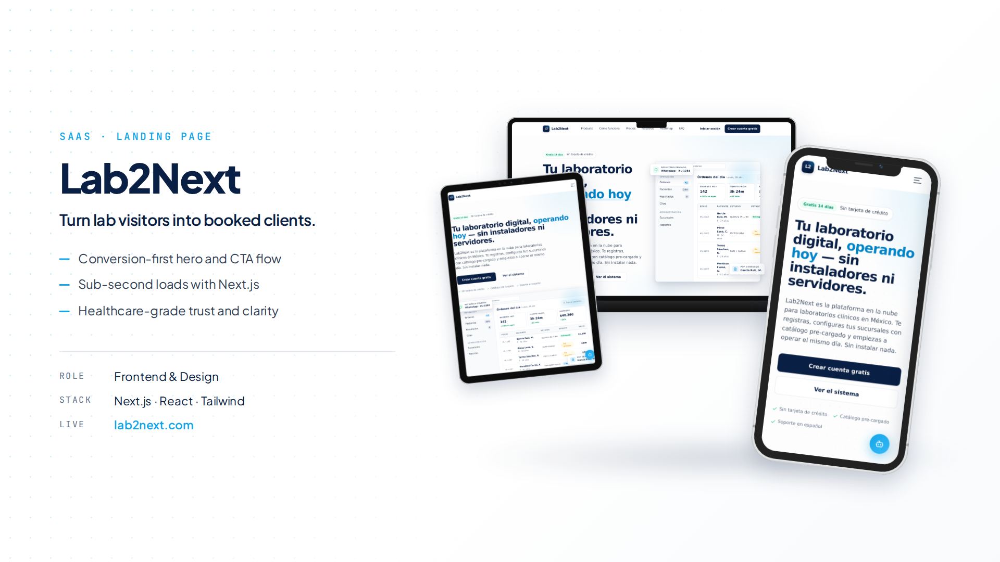
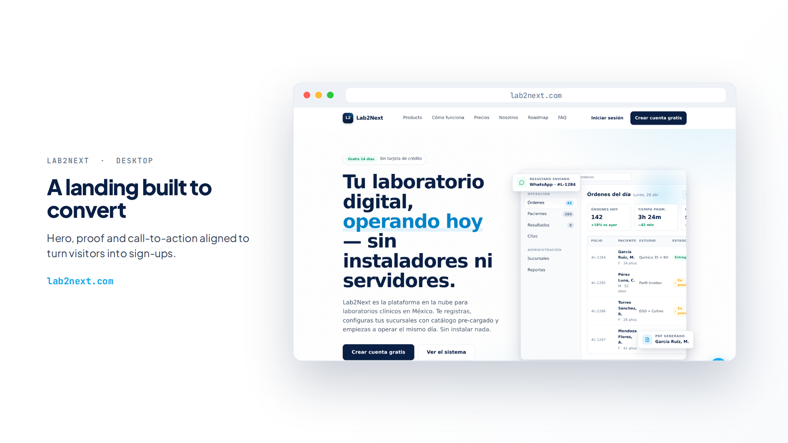
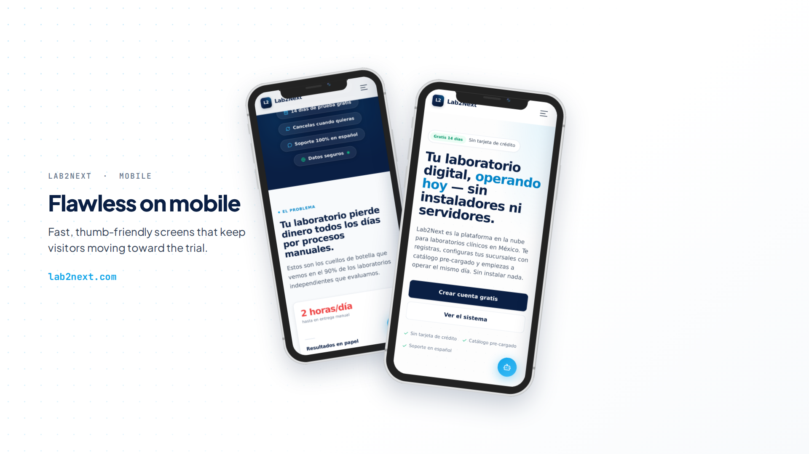
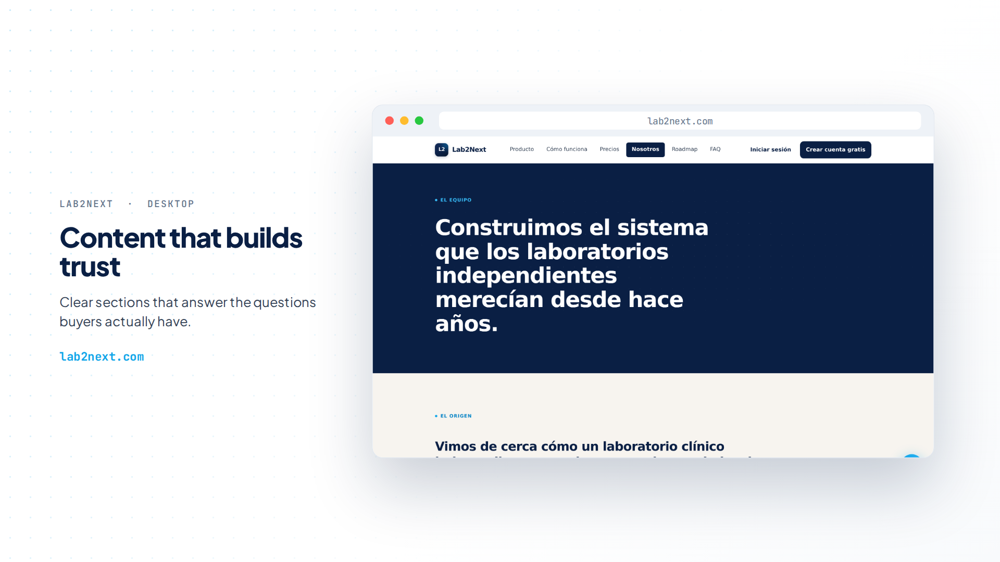
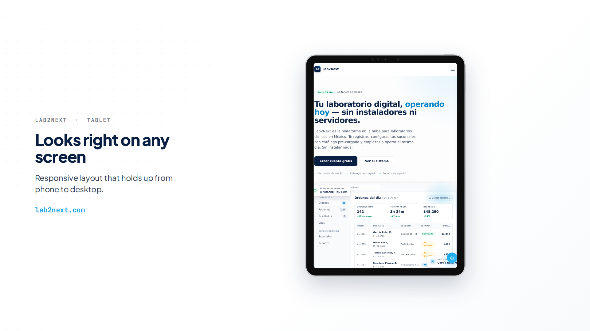

# lab2next.com

The marketing site for [**Lab2Next**](https://lab2next.com), my SaaS for clinical laboratories in Mexico. This is the page that has to convince a lab director, in one scroll, that their lab can run on something better than paper and 1998 software.



> The application itself (app.lab2next.com) is private, it is a commercial product. This repo is the public face: the landing I designed, wrote, and built to sell it.

## The idea

A landing for lab directors is not a landing for developers. My audience barely trusts software, got burned by expensive licenses, and decides with one question: "¿y esto qué tan difícil es?". Every section exists to answer that: the hero shows the actual dashboard working, the copy is in their language (orders, shifts, cash register, not "features"), and the main CTA promises the truth: registered and operating the same day.

Selling my own product taught me a kind of frontend that client work never did: when the copy, the design, and the conversion are all yours, every pixel has a job.

## What's inside

- **Animated dashboard mockup in the hero**: real product UI recreated as a living component, orders updating, WhatsApp notification popping, so the visitor sees the product before clicking anything
- **Conversion-first structure**: problem vs solution, three reasons, modules, how it works in 4 steps, pricing, FAQ, every section ends pointing to registration
- **Pricing with a Founder plan**: lifetime price for the first 20 labs, scarcity done honestly
- **Technical SEO from day one**: metadata, OpenGraph, semantic structure, performance tuning (the habits from my e-commerce years)
- **WhatsApp-first contact**: my market does not fill contact forms, they send WhatsApps, so that is the channel
- **Nexus**, the support AI agent, announced and coming soon

## A quick tour

| Desktop | Mobile |
| --- | --- |
|  |  |

| Content that builds trust | Tablet |
| --- | --- |
|  |  |

## Stack

Next.js (App Router) · TypeScript · Tailwind CSS · deployed with CI/CD

## Run it locally

```bash
pnpm install
pnpm dev
```

## The product behind it

Lab2Next is a cloud LIS: orders and patients, a WhatsApp results portal with digitally signed QR codes, appointments, cash register, and a live KPI dashboard. In production since May 2026, 50 registered users, 100+ lab exams processed. I built all of it solo, from Figma to production, including a 155-test catalog generated with AI-agent workflows and validated by practicing chemists.

## License

Source-available for viewing and reference. The code, copy, design, and brand assets belong to Lab2Next — see [LICENSE](LICENSE).

---

Designed, written, and built by [Javier Chi Ortiz](https://javierchiortiz.dev/en) in Mérida, México 🇲🇽
